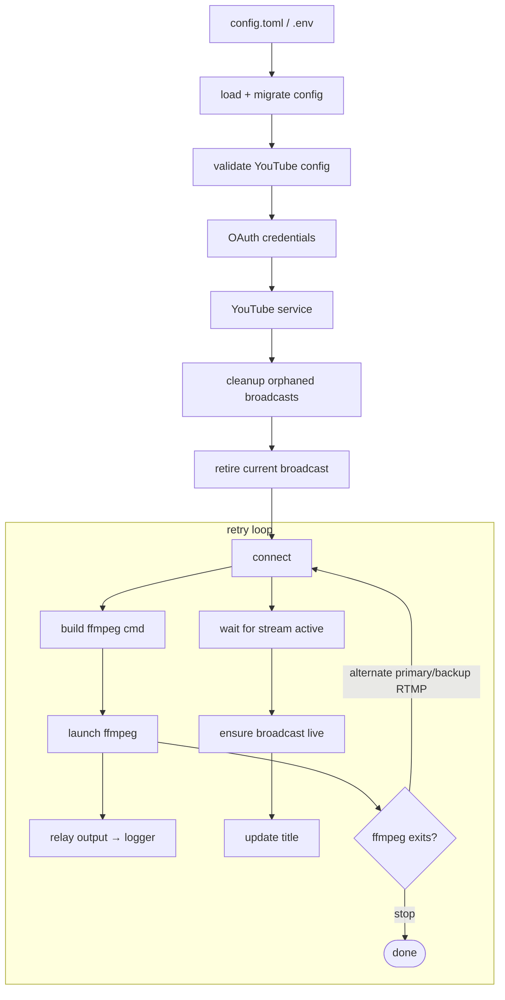

# Architecture

## Purpose

Proxy an RTSP camera feed to a **stable** YouTube Live URL, unattended, on a daily schedule, recovering automatically from crashes and reboots.

## Constraints

- **One file.** All logic lives in `src/stream.py`. It is distributed as a single GitHub Release download and run directly. See [ADR-0001](adr/0001-single-file-script.md).
- **No packaging.** No `requirements.txt`, `setup.py`, or modules. Dependencies self-install at runtime. See [ADR-0002](adr/0002-self-installing-dependencies.md).
- **No hardcoded values.** Every runtime value comes from `config.toml` (non-secret) or `.env` (secret).

## Layers

`stream.py` is internally organized into single-responsibility layers, top to bottom:

| Layer | Responsibility |
|-------|----------------|
| Dependency bootstrap | Import-or-install third-party packages before first use |
| Configuration | Load/save `config.toml`, schema defaults, migration, `--set-property` |
| Logging | Daily file + stdout logger, level filtering, retention |
| Authentication | OAuth flow, credential build/refresh/reauth |
| YouTube API — low level | One function per API call, raw response, no logging |
| YouTube API — high level | Compose calls with logging, polling, error handling |
| ffmpeg | Build command, launch, relay output, RTMP selection |
| Process / signals | PID file, stop sentinel, SIGINT/SIGTERM handling |
| Crontab | Register/remove marker-tagged cron entries |
| Commands | `do_install`, `do_start`, `do_stop`, `do_recover`, `do_update`, etc. |
| Entry point | `argparse` dispatch |

The two-tier YouTube API split keeps API calls testable and side-effect-free at the bottom while orchestration logic stays readable at the top. See [ADR-0020](adr/0020-layered-youtube-api.md).

## Data flow (`--start`)



## Stable URL guarantee

The embed URL uses the **channel** form (`/embed/live_stream?channel=...`), which always resolves to whatever broadcast is currently live. A fresh broadcast is created on every `--start`, but the embeddable page never changes. See [ADR-0009](adr/0009-stable-channel-embed-url.md).

## External strings

All user-facing prompts, guides, and messages live in `resources.toml`, downloaded alongside `stream.py`. This keeps copy out of the logic and versioned with each release. See [ADR-0021](adr/0021-externalized-strings.md).

## Repository layout

```
/
├── CLAUDE.md            # Project rules (authoritative)
├── README.md            # User quick start
├── REQUIREMENTS.md      # System + dependency requirements
├── docs/                # This documentation
│   └── adr/             # Architecture Decision Records
├── .github/workflows/
│   ├── release.yml      # Manual release publishing
│   └── test.yml         # CI: pytest + coverage
├── src/
│   ├── stream.py        # The single-file implementation
│   ├── resources.toml   # User-facing strings
│   ├── config.example.toml
│   └── example.env
└── tests/               # pytest suite, by functional area
```

## Runtime files (never committed)

| File | Created by | Purpose |
|------|-----------|---------|
| `config.toml` | `--install` | Non-secret configuration |
| `.env` | `--install` | Secrets + auto-refreshed tokens |
| `stream.pid` | `--start` | Running process PID |
| `stream.stop` | `--stop` / signal | Suppresses the retry loop |
| `logs/YYYY-MM-DD.log` | `--start` | Daily log |
| `backup/stream.*.bak.zip` | `--update` | Versioned rollback backups |
