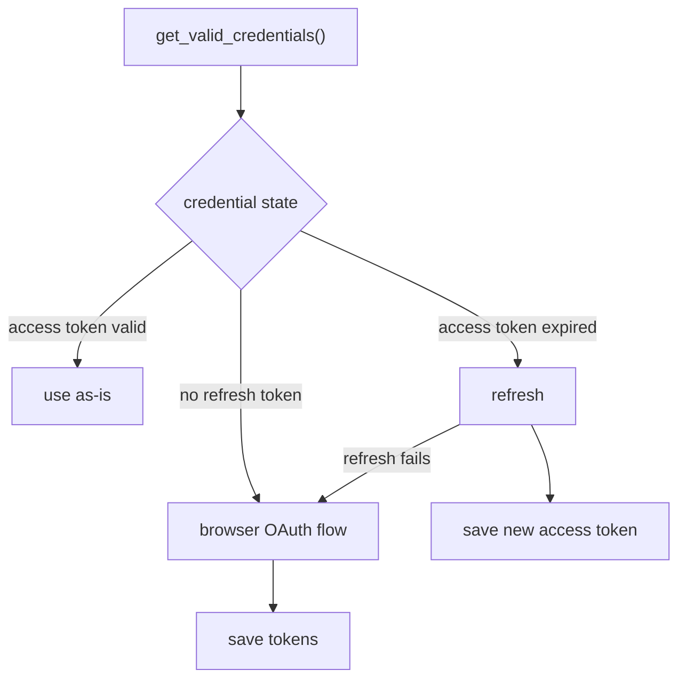

# Authentication

Google OAuth 2.0, Desktop-app flow. Credentials are split between `config.toml` (client ID) and `.env` (secret + tokens).

## Scopes

```
https://www.googleapis.com/auth/youtube
https://www.googleapis.com/auth/youtube.force-ssl
```

## Token lifecycle

| Token | Stored in | Lifetime | Refreshed |
|-------|-----------|----------|-----------|
| `GOOGLE_CLIENT_SECRET` | `.env` | permanent | never (entered at install) |
| `GOOGLE_REFRESH_TOKEN` | `.env` | long-lived | only on full re-auth |
| `GOOGLE_ACCESS_TOKEN` | `.env` | ~1 hour | automatically on each run |

## Flow



- The **initial** browser flow runs during `--install`, writing both tokens to `.env`.
- On `--start`/`--stop`/`--recover`, the refresh token mints a fresh access token; the new token is written back to `.env`.
- If the refresh token is revoked/expired, the script falls back to the interactive browser flow.

## Account selection

The OAuth flow always passes `prompt="select_account"`, forcing the account chooser every time. This prevents silently re-authorizing the wrong Google account on multi-account machines (PR #16). See [ADR-0022](adr/0022-force-account-selection.md).

## Install-time reuse

On re-install, `--install` tries to reuse the stored refresh token before opening a browser. If it refreshes successfully, the browser flow is skipped entirely — re-running setup does not force re-authorization.

## Secret hygiene

Secrets are never logged, printed, or embedded in any ffmpeg command string that reaches the logs — the stream key is redacted as `<REDACTED>` in the launch log line.
