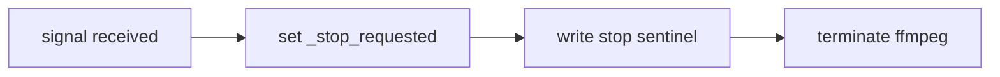
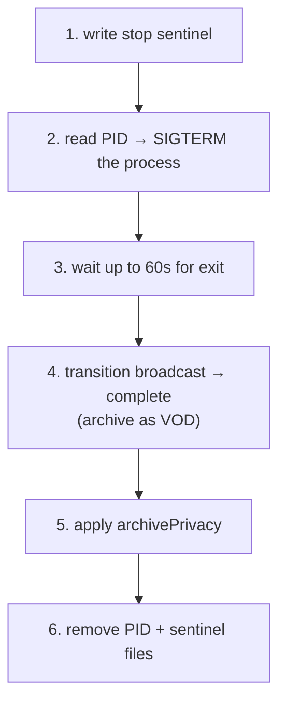

# Process Management

Two files coordinate the single foreground `--start` process and out-of-band control.

## PID file (`stream.pid`)

- Written by `--start` with the running PID.
- `--start` reads it first: if a live process exists, it is `SIGTERM`-ed and waited on before the new one starts (single-instance guarantee).
- Stale PID files (process not alive) are detected and removed.
- Always cleaned up on exit.

## Stop sentinel (`stream.stop`)

A presence-only flag file that tells the retry loop to stop.

- Created by `--stop` and by the signal handler.
- Checked before every retry attempt and during the retry delay. If present, the loop exits cleanly instead of reconnecting.
- Cleared at the start of `--start` and removed on shutdown.

The sentinel decouples "stop streaming" from "kill process": even mid-retry-delay, the loop notices the sentinel and exits without another ffmpeg launch.

## Signals

`SIGINT` and `SIGTERM` are both treated as a graceful stop, identical to `--stop`:

This makes `Ctrl-C`, `kill`, and the stop cron behave the same way. Handlers are registered at the start of `--start`.

## `--stop` sequence

Broadcast config is preserved so the next `--start` can reuse the stream resource.

## Cleanup invariants

- `stream.pid` and `stream.stop` are always removed on exit, whether clean or signal-driven.
- ffmpeg is terminated and waited on if still running when the loop ends.
