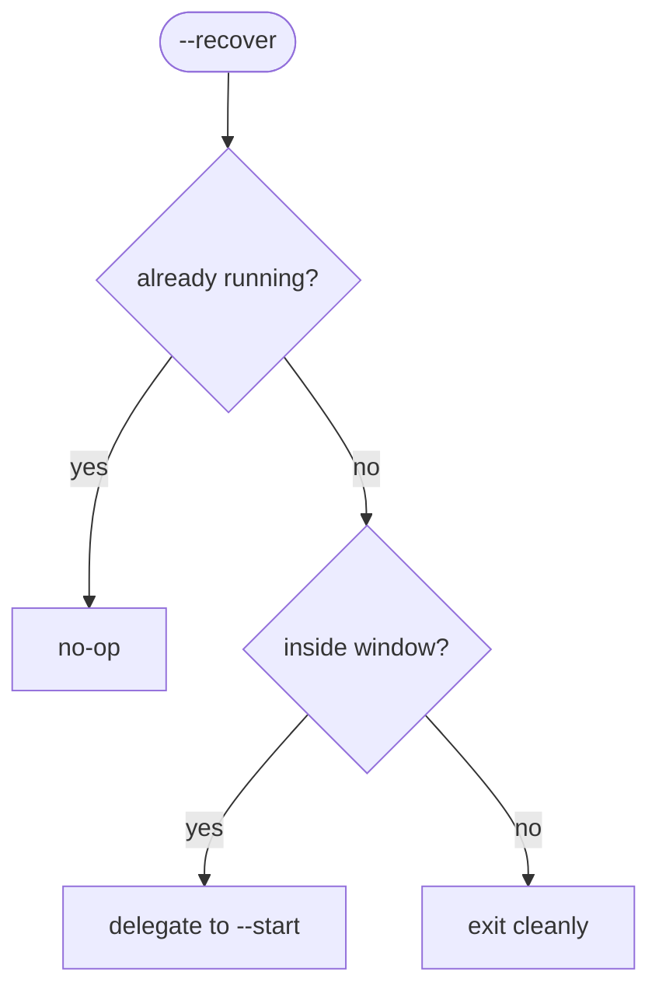

# Scheduling

`--install` self-registers cron entries so the stream runs unattended. The default schedule is **April 1 – October 31** (the flying season).

## Registered entries

| Job | Default schedule | Runs | Window |
|-----|-----------------|------|--------|
| Start | `30 6 1-31 4-10 *` (6:30 AM) | `--start` in a terminal window | Apr–Oct |
| Stop | `25 18 1-31 4-10 *` (6:25 PM) | `--stop` headless | Apr–Oct |
| Recover | `@reboot` | `--recover` headless | boot |
| Update *(opt-in)* | `0 0 * * *` (midnight) | `--update` headless | when `autoUpdate` |

## Marker-based idempotency

Every entry carries the trailing comment `# bcfreeflight_stream`. Registration removes all marked lines, then re-adds them — so re-running `--install` never duplicates entries, and `--uninstall` removes exactly this script's lines and nothing else. See [ADR-0015](adr/0015-cron-self-registration.md).

## Terminal handling

The start job opens a **single** visible terminal window titled "BC Free Flight Stream" (so it can be observed). When the stop job fires, the process exits and the window closes — preventing window accumulation. Stop and recover run headless (recover runs at `@reboot` before any graphical session exists).

The cron line format adapts to the detected terminal:

| Terminal | Invocation |
|----------|-----------|
| `gnome-terminal` | `--title=... -- <python> stream.py --start` |
| `xfce4-terminal` | `--title=... -e "<python> stream.py --start"` |
| other (`xterm`, `konsole`) | `-T '...' -e <python> stream.py --start` |

Start lines are prefixed with `DISPLAY=:0` so cron can reach the X session.

## `--recover`

Crash/reboot recovery, registered as the `@reboot` entry:

The window check (`is_in_stream_window`) compares the most recent fire times of `cron.start` vs `cron.stop` using `croniter`: if start fired more recently than stop, we are inside the window. This reuses real cron semantics (including day/month ranges) instead of reimplementing them, and adds a 1-second epsilon so the exact start second counts as inside. See [ADR-0016](adr/0016-reboot-crash-recovery.md).

## Auto-update cron

Opt-in only (`cron.autoUpdate = false` by default) to avoid unattended updates without consent. When enabled, the update entry is registered alongside the others. See [updates](updates-and-rollback.md) and [ADR-0017](adr/0017-optional-auto-update.md).
